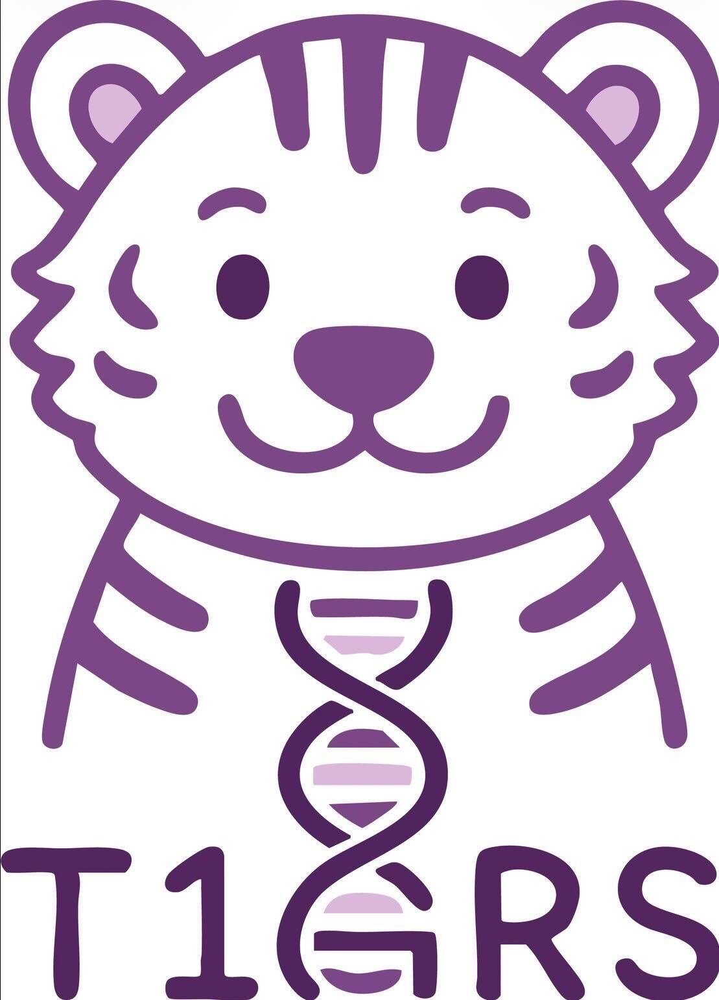

<div align="center">

# T1GRS Docker Build and Run Guide


</div>

## Overview

This project provides a T1GRS Docker image that can be pulled from Docker Hub and run locally. The Docker image contains all necessary dependencies and test data to get started quickly.

## IMPORTANT
Our GitHub repository doesn't include the data model due to its large size. However, you can find everything you need to run T1GRS, including the data model and test data, on our [DockerHub](https://hub.docker.com/r/kgaultonlab/t1d-grs-analysis-r3-catboost).

## Step 1
To run T1GRS, you first need to run the code in [extract-TOPMed-Michigan-HLA GitHub repository](https://github.com/Gaulton-Lab/extract-TOPMed-Michigan-HLA). These tools automate the process of extracting specific SNP variants from multiple VCF files (both TOPMed and Michigan HLA datasets) and combine these extracted variants into a single VCF file for further analysis. This combined VCF file is in the desired input format needed to run the code in this repository.

## Step 2
### Prerequisites

- Docker installed on your local machine. You can download Docker from [here](https://www.docker.com/get-started).

### Getting Started

### Pull the Docker Image

First, pull the Docker image from Docker Hub:

```bash
docker pull kgaultonlab/t1d-grs-analysis-r3-catboost:latest
```

### Run the Docker Container

Run the Docker container using the image you pulled. All necessary data is already included in the image, so you do not need to mount any external volumes. Use the following script to run the container and execute the analysis:

```bash
#!/bin/bash

# Run the Docker container
docker run --name t1grs_analysis \
  -v /path/to/your/data:/data \
  kgaultonlab/t1d-grs-analysis-r3-catboost:latest \
  --vcf_path /data/your_input.vcf \
  --r3_variants_path /data/T1GRS_allele_order.txt \
  --r2_snps_path /data/ALL5_199_TOPMED_SUSIE_HLA_T1D_signals_updateID_r3.vcf.alleles \
  --allele_order_path /data/ALL5_199_TOPMED_SUSIE_HLA_T1D_signals_updateID.vcf.alleles \
  --catboost_all_model_path /data/ALL_No_PCS_catboost.ubj \
  --catboost_nohla_model_path /data/NonHLA_No_PCS_catboost.ubj \
  --catboost_hlaonly_model_path /data/HLA_No_PCS_catboost.ubj \
  --all_columns_path /data/ALL_columns.txt \
  --hla_columns_path /data/HLA_columns.txt \
  --nonhla_columns_path /data/nonHLA_columns.txt \
  --total_percentiles_path /data/T1GRS_total_percentile_risk.txt \
  --mhc_percentiles_path /data/T1GRS_MHC_percentile_risk.txt \
  --nonmhc_percentiles_path /data/T1GRS_nonMHC_percentile_risk.txt \
  --output_path /data/T1GRS_probabilities_r3.csv

# Copy the output file from the container to the host directory
docker cp t1grs_analysis:/data/T1GRS_probabilities_r3.csv /path/to/your/output/directory/T1GRS_probabilities_r3.csv

# Stop and remove the container
docker stop t1grs_analysis
docker rm t1grs_analysis
```

Replace `/path/to/your/output/directory` with the actual path where you want to save the output file on your host machine.

## Citation

If you use this tool, please cite:
McGrail, C., Sears, T.J., Griffin, E.N., Ghaben, A.L., Smadbeck, P., Flannick, J., Kudtarkar, P., Carter, H. & Gaulton, K. (2026). Genetic association and machine learning improve the prediction of type 1 diabetes risk. *Nature Genetics*. https://www.nature.com/articles/s41588-026-02578-y

### COPYRIGHT & LICENSE

```
Copyright Notice
This software is Copyright © 2024 The Regents of the University of California. All Rights Reserved. Permission to copy, modify, and distribute this software and its documentation for educational, research, and non-profit purposes, without fee, and without a written agreement is hereby granted, provided that the above copyright notice, this paragraph, and the following three paragraphs appear in all copies. Permission to make commercial use of this software may be obtained by contacting:

Office of Innovation and Commercialization
9500 Gilman Drive, Mail Code 0910
University of California
La Jolla, CA 92093-0910
innovation@ucsd.edu

This software program and documentation are copyrighted by The Regents of the University of California. The software program and documentation are supplied “as is”, without any accompanying services from The Regents. The Regents does not warrant that the operation of the program will be uninterrupted or error-free. The end-user understands that the program was developed for research purposes and is advised not to rely exclusively on the program for any reason.

IN NO EVENT SHALL THE UNIVERSITY OF CALIFORNIA BE LIABLE TO ANY PARTY FOR DIRECT, INDIRECT, SPECIAL, INCIDENTAL, OR CONSEQUENTIAL DAMAGES, INCLUDING LOST PROFITS, ARISING OUT OF THE USE OF THIS SOFTWARE AND ITS DOCUMENTATION, EVEN IF THE UNIVERSITY OF CALIFORNIA HAS BEEN ADVISED OF THE POSSIBILITY OF SUCH DAMAGE. THE UNIVERSITY OF CALIFORNIA SPECIFICALLY DISCLAIMS ANY WARRANTIES, INCLUDING, BUT NOT LIMITED TO, THE IMPLIED WARRANTIES OF MERCHANTABILITY AND FITNESS FOR A PARTICULAR PURPOSE. THE SOFTWARE PROVIDED HEREUNDER IS ON AN “AS IS” BASIS, AND THE UNIVERSITY OF CALIFORNIA HAS NO OBLIGATIONS TO PROVIDE MAINTENANCE, SUPPORT, UPDATES, ENHANCEMENTS, OR MODIFICATIONS.
```

## Contact
If you have any questions, feel free to open an issue.
